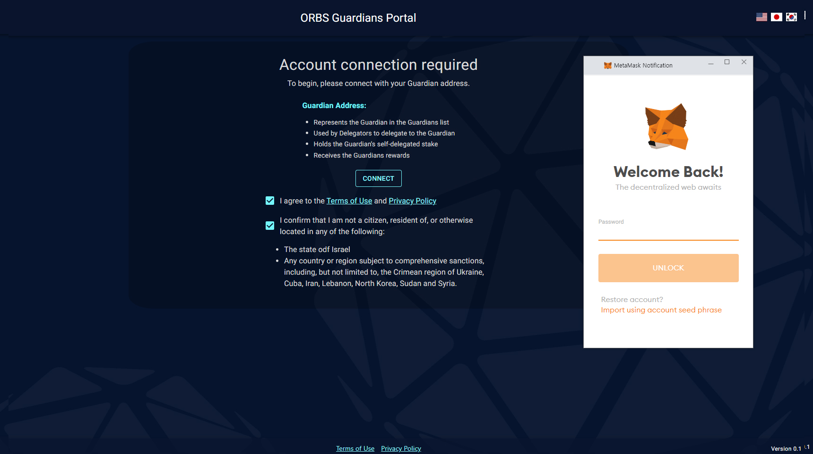

# ORBS Guardians Portal
To register a guardian on the network, ORBS Guardians portal provides very useful web user interface.
Please follow the instruction belows:

### Prerequisites
* Orbs node setup by you
* Chrom browser
* [Metamask](https://metamask.io/)

## Connect
Import your guardians wallet in metamask wallet.
1. Please visit [HERE](https://guardians.orbs.network/) to use the portal.

2. check agreement and click "CONNECT" button and do login metamask

## REGISTER
1. After login, you may see a page below:

2. Please input required information and click "REGISTER" button
3. Approve transaction with metamask
4. Few minutes later after transaction is confirmed, it will be shwon on the [guardians list](https://analytics.orbs.network/overview/stake)

## INFO
1. If you are registered guardian, the portal will open info page automatically when you connect portal

2. Review and if you want to update guardian's information, click the tab which you want to update.

## EDIT INFO
1. Input updated info in the dotted box below and click "UPDATE INFO" button
2. Click "Accept" button
3. Approve transaction with metamask

* NOTE: update info does ___NOT___ require re-installation of orbs node.

## DELEGATORS SHARE
1. Each guardians may want to change rewards sharing rate to their delegators. Update share rate in percentage number, click "UPDATE DELEGATORS SHARE"
2. Click "Accept" button and approve transaction.

* NOTE: The input number must be between 0 and 66.667

## GUARDIAN DETAILS URL
* To be a certified guardian, you have to provide valid url which includes required detail information.
1. input the URL and click button
2. Click "Accept" button and approve transaction.

## UNREGISTER
* To unregister, click the "UNREGISTER" button
* Click "Accept" button and approve transaction.

* NOTE: Please don't forget destroy validator nodes